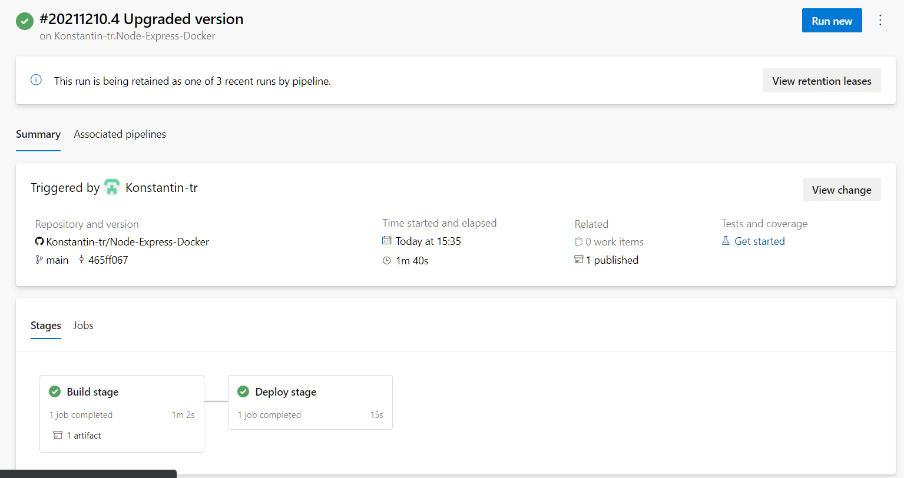
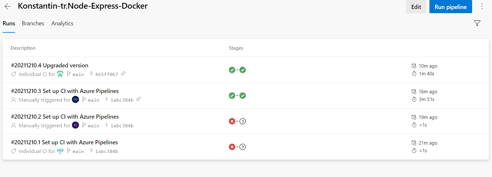
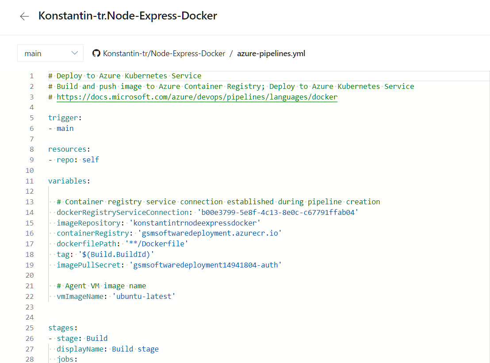
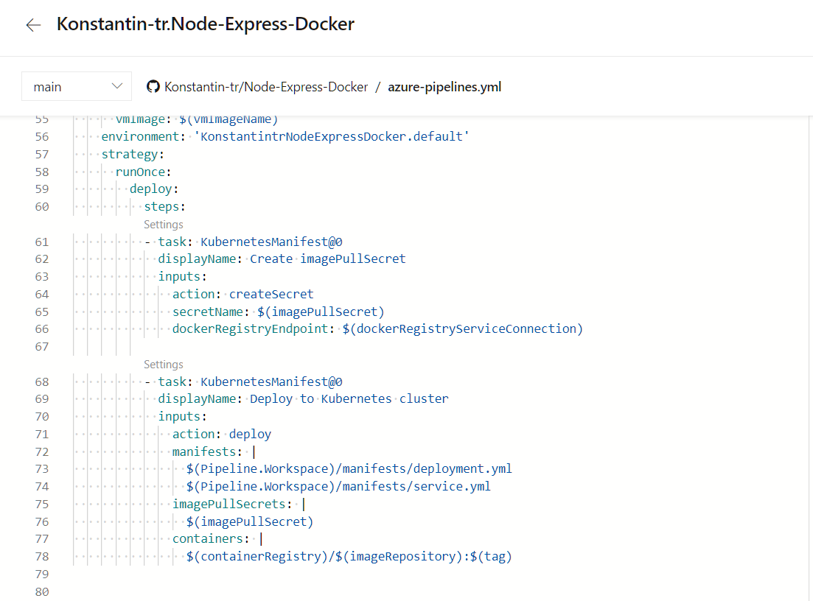
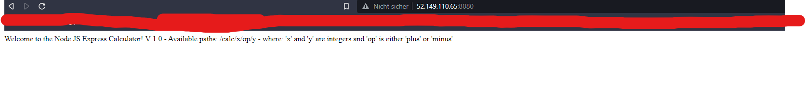
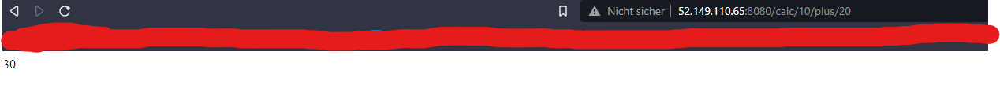

# Software Deployment Übung

## Teilnehmer

- Severin Mikesch
- Konstantin Siegl
- Markus Gamperl

## Source Files - Link zum Source Repo

https://github.com/Konstantin-tr/Node-Express-Docker

## Public IP Address

http://52.149.110.65:8080/

## Dokumentation

- Es wurde eine Node.js Applikation erstellt, welche mit Express eine Webanwendung anbietet.
- Daneben wurde ein Dockerfile erstellt, über welches ein Image gebaut werden kann, dass diese Applikation dann ausführt.
- Als nächstes wurde eine Azure Container Registry erstellt und ein AKS-Cluster.
- Über ein Template wurde dann eine Azure Dev Ops Pipeline erstellt, welche das Docker Image vom Github Repo aus baut und dann bei Kubernetes in den Cluster hochlädt.
- Dadurch kann nun bei jedem Commit in das Repo automatisch der Cluster upgedatet werden.

## Entscheidungen

- Azure Container Registry wurde auf Grund der guten Anbindung an den AKS-Cluster gewählt.
- Hier wurde auf die Premium Version auf Grund der Kosten verzichtet. Deshalb kann man die Registry nicht von außen abrufen.
- Als Applikation wurde eine simple Taschenrechner API gewählt, da diese leicht zu programmieren war und trotzdem beachtliche Funktionalität bietet.
- Das Template wurde gewählt, da dadurch die Manifest-files automatisch erstellt wurden und der Prozess deutlich leichter wurde.

## Pipeline YAML

```yaml
# Deploy to Azure Kubernetes Service
# Build and push image to Azure Container Registry; Deploy to Azure Kubernetes Service
# https://docs.microsoft.com/azure/devops/pipelines/languages/docker

trigger:
  - main

resources:
  - repo: self

variables:
  # Container registry service connection established during pipeline creation
  dockerRegistryServiceConnection: "b00e3799-5e8f-4c13-8e0c-c67791ffab04"
  imageRepository: "konstantintrnodeexpressdocker"
  containerRegistry: "gsmsoftwaredeployment.azurecr.io"
  dockerfilePath: "**/Dockerfile"
  tag: "$(Build.BuildId)"
  imagePullSecret: "gsmsoftwaredeployment14941804-auth"

  # Agent VM image name
  vmImageName: "ubuntu-latest"

stages:
  - stage: Build
    displayName: Build stage
    jobs:
      - job: Build
        displayName: Build
        pool:
          vmImage: $(vmImageName)
        steps:
          - task: Docker@2
            displayName: Build and push an image to container registry
            inputs:
              command: buildAndPush
              repository: $(imageRepository)
              dockerfile: $(dockerfilePath)
              containerRegistry: $(dockerRegistryServiceConnection)
              tags: |
                $(tag)

          - upload: manifests
            artifact: manifests

  - stage: Deploy
    displayName: Deploy stage
    dependsOn: Build

    jobs:
      - deployment: Deploy
        displayName: Deploy
        pool:
          vmImage: $(vmImageName)
        environment: "KonstantintrNodeExpressDocker.default"
        strategy:
          runOnce:
            deploy:
              steps:
                - task: KubernetesManifest@0
                  displayName: Create imagePullSecret
                  inputs:
                    action: createSecret
                    secretName: $(imagePullSecret)
                    dockerRegistryEndpoint: $(dockerRegistryServiceConnection)

                - task: KubernetesManifest@0
                  displayName: Deploy to Kubernetes cluster
                  inputs:
                    action: deploy
                    manifests: |
                      $(Pipeline.Workspace)/manifests/deployment.yml
                      $(Pipeline.Workspace)/manifests/service.yml
                    imagePullSecrets: |
                      $(imagePullSecret)
                    containers: |
                      $(containerRegistry)/$(imageRepository):$(tag)
```

## Images

### Last pipeline run



### Pipeline runs



### Pipeline yaml 1



### Pipeline yaml 2



### Website 1



### Website 2


